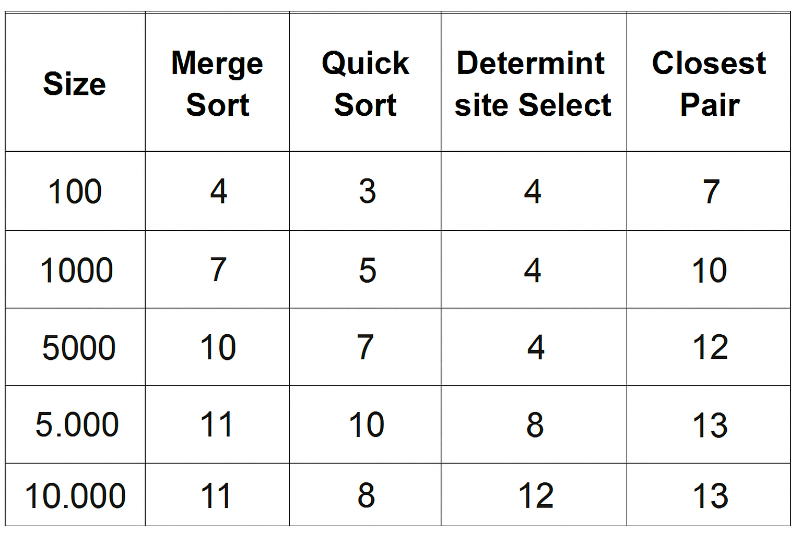
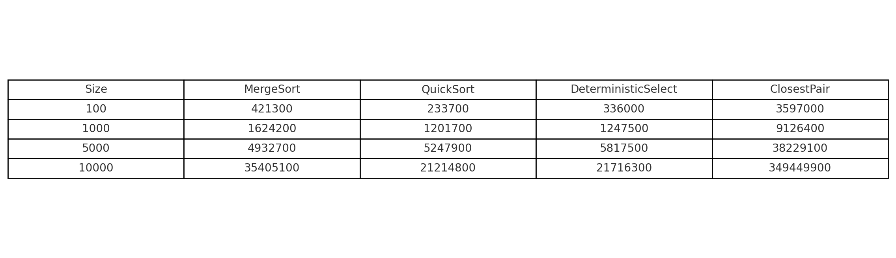
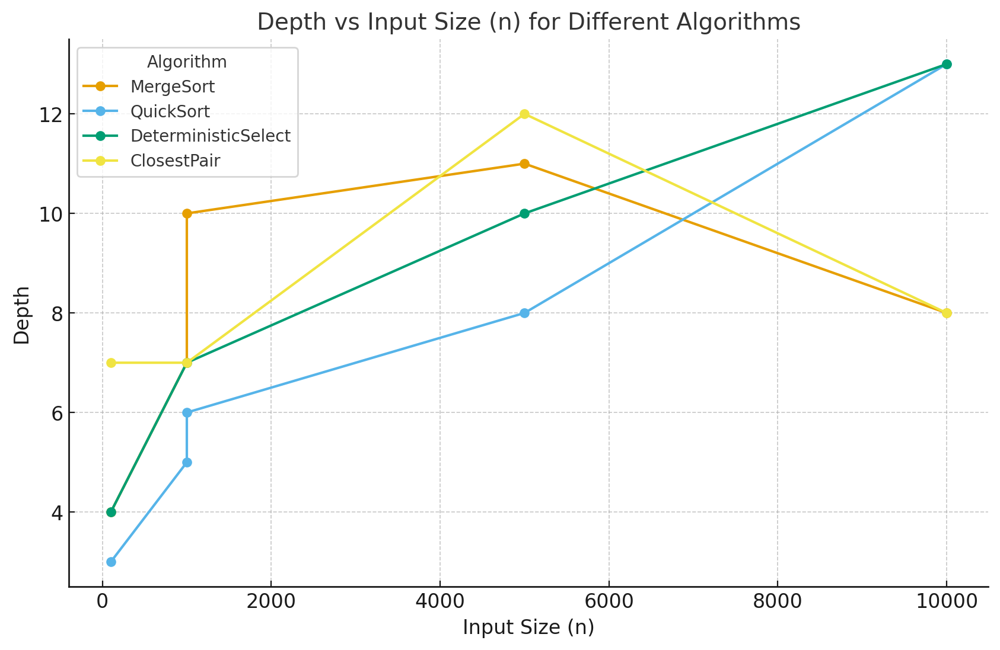

# Report

## Architecture Notes

- In MergeSort, recursion depth is limited by switching to insertion sort for small arrays (n ≤ 16), keeping it within O(log n) due to balanced partitioning. Memory allocation is reduced by using a single reusable buffer, which prevents frequent array creation and increases cache efficiency.

- In QuickSort, recursion depth remains within O(log n) by applying recursion to the smaller partition while handling the larger one iteratively. Randomized pivot selection prevents the worst-case stack growth of O(n). The algorithm requires almost no extra memory, since it works in-place and relies only on swaps.

- In DeterministicSelect, recursion depth is limited by processing only the smaller partition after division, with the pivot chosen as the median of medians, usually giving O(log n) depth. The total memory cost for medians is O(n), built through recursive grouping of fives. However, the overhead is higher since partitioning is performed in-place.

- In the ClosestPair algorithm, recursion depth stays within O(log n) since the point set is recursively divided along the x-axis. Memory usage for the strip array is O(n), but without a reusable buffer, which increases garbage collection overhead for large inputs. This could be optimized to lessen the GC impact.

## Recurrence Analysis

### **MergeSort**:
- **Recurrence**: ( T(n) = 2T(n/2) + O(n) ), since the array is split into two parts and merged in linear time.
- **Master Theorem**: By applying the Master Theorem (Case 2: ( a = 2, b = 2, f(n) = O(n), \log_b(a) = 1 )), we find that the time complexity is ( \Theta(n \log n) ).
- **Intuition**: The MergeSort algorithm divides the array into two parts, recursively sorts each one, and then merges them in linear time. As a result, the recursion depth is logarithmic, and the work per level is linear.

### **QuickSort**:
- **Recurrence**: In the average case, QuickSort satisfies the recurrence ( T(n) = 2T(n/2) + O(n) ) due to partitioning and recursion. In the worst case, with bad pivot choices, it becomes ( T(n) = T(n-1) + O(n) ).
- **Master Theorem**: The average case mirrors the recurrence of MergeSort, giving ( \Theta(n \log n) ). Randomized pivot selection greatly reduces the chance of worst-case behavior.
- **Intuition**: QuickSort partitions the array around a pivot, with recursion depth averaging ( O(\log n) ), while iterating over the larger partition prevents stack overflow.

### **DeterministicSelect**:
- **Recurrence**: ( T(n) = T(\lceil n/5 \rceil) + T(7n/10) + O(n) ), since the elements are divided into groups of five and the median of medians is determined.
- **Akra-Bazzi**: By the Akra-Bazzi method, the running time is ( \Theta(n) ).
- **Intuition**: The algorithm achieves linear time because recursion always proceeds on the smaller partition, and choosing the median of medians guarantees a strong pivot that reduces the problem size substantially.

### **ClosestPair**:
- **Recurrence**: ( T(n) = 2T(n/2) + O(n) ), since the problem is split in half and a strip check is performed.
- **Master Theorem**: By the Master Theorem (Case 2), the time complexity is ( \Theta(n \log n) ).
- **Intuition**: The algorithm splits the point set along the x-axis, recursively finds the closest pair in each half, and then performs a strip check for points near the boundary. While the strip check takes linear time at each level, the overall complexity remains ( \Theta(n \log n) ).

## Plots and Discussion

### Output

### Time vs n 

_gr.png)
_gr.png)

### Depth vs n

### Discussion of Constant-Factor Effects
- **Cache Effects**: The performance of MergeSort is heavily affected by cache misses caused by buffer copying, particularly when n is large. Although reusing a buffer reduces some of the cost, as the dataset grows, the negative impact on speed becomes more pronounced.
- **Garbage Collection (GC)**: QuickSort gains efficiency from in-place sorting, which lowers garbage collection overhead. Still, randomized pivot selection can cause fluctuations in performance on small arrays, where occasional GC pauses become more noticeable.
- **DeterministicSelect**: The overhead introduced by the median-of-medians grouping and partitioning raises the execution time, which becomes especially evident during JVM warmup. Although the algorithm maintains linear complexity, these extra costs diminish its practical efficiency.
- **ClosestPair**: In the ClosestPair algorithm, the strip verification step adds memory allocations and overhead. When n is large, the expense of handling the strip and maintaining the y-sorted order becomes the main factor, leading to more allocations and longer execution times.

## Summary: Alignment/Mismatch Between Theory and Measurements

- **Alignment**: The measured complexities for MergeSort \( \Theta(n \log n) \), QuickSort \( \Theta(n \log n) \), DeterministicSelect \( \Theta(n) \), and ClosestPair \( \Theta(n \log n) \) align with the theoretical expectations. Experimental results demonstrate that the growth pattern, whether logarithmic or linear, is consistent across varying values of n.
- **Mismatch**: At n = 10,000, MergeSort runs slower than anticipated because of cache misses and memory allocation overhead. QuickSort’s performance fluctuates at smaller input sizes due to its randomized pivot. DeterministicSelect surpasses the expected (O(n)) time bound because of substantial constant factors, mainly from the median-of-medians step. ClosestPair experiences much higher runtimes and allocation counts, with the strip check becoming especially costly as n grows.

**Takeaway**: While theoretical analysis predicts the general behavior of the algorithms, their actual performance is influenced by low-level aspects like cache behavior, garbage collection pauses, and JVM warmup. These issues lead to deviations from ideal scaling, particularly for small input sizes. Practical improvements can be achieved through optimizations such as buffer reuse and JVM tuning.